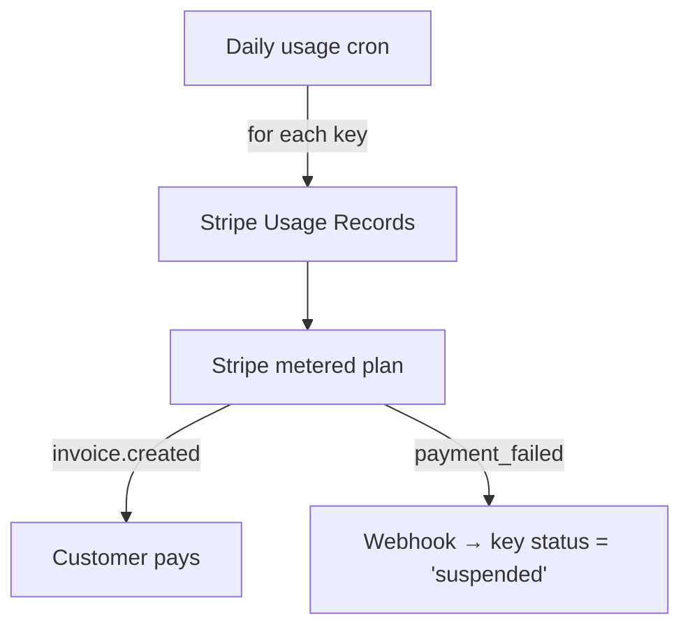

# UFO Sightings API — Hosting & Monetization Guide  
*Last updated: 2025-06-30*

This doc combines two key areas you asked about:

1. **API‑key + metered billing strategy** – how to protect and monetize your endpoint.  
2. **Dataset handling for ~80 000 sightings** – schema, infra and cost tiers.

---

## 1 API Keys & Usage‑Based Billing

### 1.1 Standard API‑key flow

| Step | Typical tooling | Notes |
|------|-----------------|-------|
| **Key creation** | Dashboard/CLI → store **hashed** key in `keys` table (`id, owner_id, hash, tier, quota_used`) | Never store raw keys. |
| **Client credential** | `Authorization: Bearer sk_live_…` **or** `X-API-Key:` header | One clear header avoids CORS issues. |
| **Middleware verify + meter** | Cloudflare Worker, AWS API Gateway Usage Plan, Kong, or Express/Flask middleware | Lookup → verify → increment counter. |
| **Quota counter** | Redis/Upstash or Postgres `quota_used = quota_used + 1` | Atomic; nightly job syncs to billing. |
| **Rate‑limit** | Token bucket per key (e.g., 60 req/min for free) | Built‑in on API Gateway / Cloudflare. |

### 1.2 Charging after the free quota

| Model | UX | Real‑world examples |
|-------|----|--------------------|
| **Tier + hard cut‑off** | 429 after quota | GitHub anonymous 60 req/hr vs 5 000 authenticated |
| **Tier + overage (recommended)** | Keep serving, bill \$/extra call | RapidAPI default: “5 000 free → \$0.05/1 000 overage” |

**Suggested starter tiers**

| Tier | Monthly calls | Burst rpm | Price |
|------|--------------:|----------:|------:|
| Community | 10 000 | 60 | Free |
| Researcher | 100 000 | 300 | \$9 |
| Power | 1 000 000 | 1 000 | \$49 |
| Enterprise | custom | custom | contact |

### 1.3 Billing plumbing (Stripe example)



* One scheduled job pushes totals via `stripe.usage_records.create(...)`.  
* On `invoice.payment_failed`, automatically downgrade or disable the key.

### 1.4 Abuse & cost controls

* CDN `Cache‑Control: public, max‑age=86400` so duplicates never hit origin.  
* Email‑verified keys stop anonymous scraping.  
* Alert when any key jumps > 10× its 7‑day avg.  
* `status` column lets you kill a key instantly.

---

## 2 Hosting the 80 000‑row Dataset

### 2.1 Why this is easy

*80 000 rows × ~1 kB ≈ 80 MB* – fits in RAM and every free serverless DB tier.

### 2.2 Storage options

| Option | Best for | Pros | Cons |
|--------|----------|------|------|
| **Supabase Postgres (+ PostGIS)** | Full‑text + geo search | Free 500 MB, REST auto‑gen | 50–150 ms cold starts |
| **Edge SQLite (Turso, Cloudflare D1)** | Mostly read‑only, ultra‑low latency | Global replication | Writes slower |
| **Static Parquet in S3/R2 + DuckDB** | Bulk downloads | Cheapest egress | Not great for interactive filter API |

*Recommended:* start on **Supabase** → expose via Edge Functions or Cloudflare Workers.

### 2.3 Schema & indexes

```sql
create table sightings (
  id          bigserial primary key,
  occurred_at timestamptz,
  city        text,
  state       text,
  country     text,
  latitude    double precision,
  longitude   double precision,
  shape       text,
  summary     text,
  source      text
);

-- Full‑text
create index sightings_fts on sightings
  using gin (to_tsvector('english', summary));

-- Geospatial
select postgis_addbbox('sightings', 'geom');
create index sightings_geom on sightings using gist (geom);

-- Time
create index sightings_time on sightings(occurred_at);
```

### 2.4 Cursor pagination pattern

```http
GET /v1/sightings?state=NE&limit=50&cursor=99872
→ 200 OK
{
  "data": [ …50 rows… ],
  "next_cursor": 99822,
  "total_remaining": 950
}
Cache-Control: public, max-age=86400
```

### 2.5 Cost ‑ traffic matrix

| Monthly calls | Cloudflare Workers Paid | Supabase Pro |
|--------------:|-----------------------:|-------------:|
| ≤ 3 M (free tier) | \$0 | \$0 |
| 10 M | \$7.70 | \$25 |
| 50 M | \$19.70 | \$25 + over‑egress |
| 100 M | \$34.70 | Upgrade plan |

### 2.6 Bulk‑download endpoint

* Nightly cron dumps `sightings-YYYYMMDD.parquet.gz` to R2/S3.  
* `/v1/download/latest` returns a 302 to that object.  
* Heavy researchers hit object storage (cheap) not your DB.

### 2.7 Migration from 1 000‑row sample

1. `COPY` full CSV into Supabase.  
2. `VACUUM ANALYZE`.  
3. Confirm query times (< 10 ms).  
4. Deploy, keep per‑key quotas on.

---

## TL;DR

* Require **API keys day 1**; free quota + metered overage keeps hobbyists happy while funding infra.  
* 80 MB dataset lives comfortably in free serverless Postgres; index for text + geo, paginate with cursors.  
* CDN caching + per‑key rate‑limits mean even viral traffic costs pocket change—and scales linearly with revenue.
